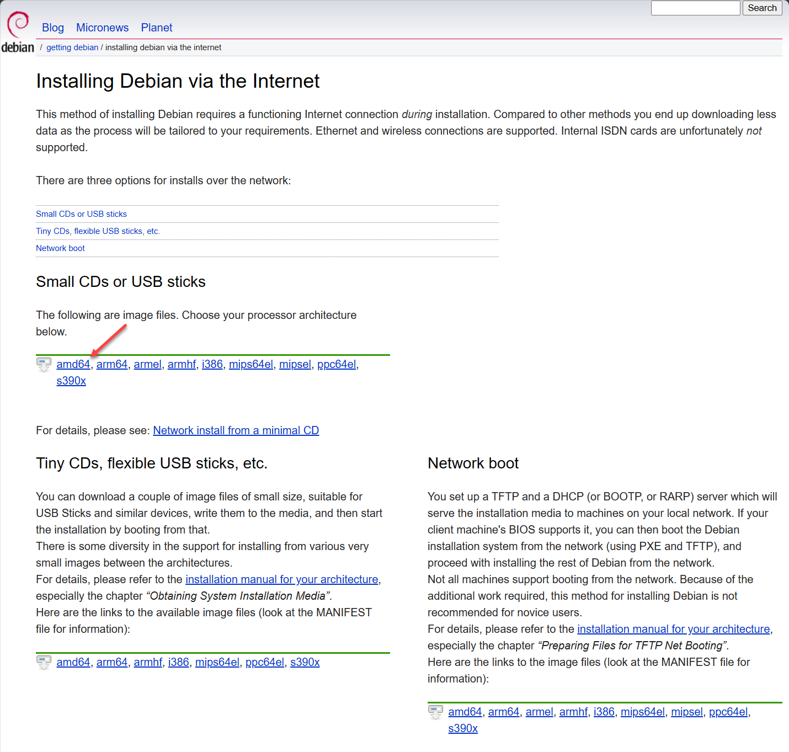
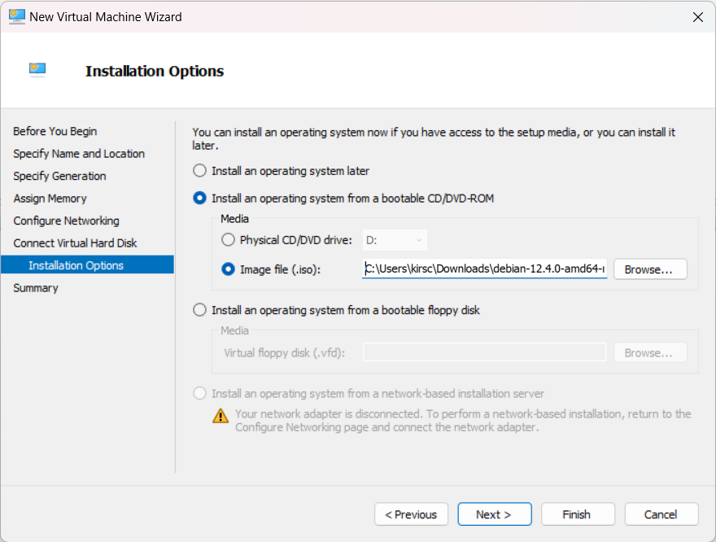
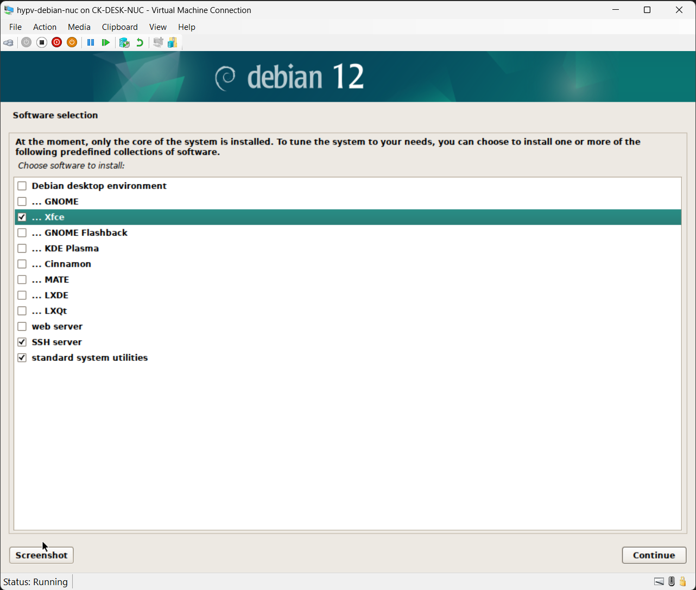

# Install a Debian machine on Hyper-V

1. Download an amd64 image from https://www.debian.org/distrib/netinst. "Small CDs or USB sticks" works. As of 2024-01-15, [Microsoft only claims support for Debian 10/11](https://learn.microsoft.com/en-us/windows-server/virtualization/hyper-v/supported-debian-virtual-machines-on-hyper-v), but I am using Debian 12 currently with no issues.

2. Use the creation wizard (New -> Virtual Machine) in Hyper-V. Default settings are fine. Recommend "Generation 2" virtual machine; "Generation 1" virtual machines have issues if you want to use Xfce for your desktop environment.

3. Turn on the VM and connect to begin the Debian install wizard. If you are presented with a black sceen, try pressing <kbd>Enter</kbd>. Create a root password and store in password manager.
4. Create default user *<default_username>*.
5. Create default password and store in password manager.
6. Finish Debian install, using default settings until the "Software selection" screen, where I recommend the following settings:
   1. Xfce
   2. SSH Server
   3. standard sysem utilities

# Add default user to sudoers file

    su root
    sudo adduser <default_username> sudo

Log out and back in for update to take effect.

# Start and configure SSH server on VM

Check that SSH is running:
    
    systemctl status ssh

If not:

    sudo systemctl start ssh
    sudo systemctl enable ssh

If SSH is not installed:

    sudo apt-get install openssh-server

Create and secure the SSH authorized public keys file:

    mkdir -p ~/.ssh
    chmod 700 ~/.ssh
    touch ~/.ssh/authorized_keys
    chmod 600 ~/.ssh/authorized_keys

# Test SSH from remote machine and remove password access

Find IP address for VM:

    ipaddress ip address | grep -i eth0

On remote machine, SSH into VM using default user password authentication:

    ssh <default_username>@<vm_ip_address>

Open the authorized_key file and paste in the SSH public key for the remote machine:

    nano ~/.ssh/authorized_keys

Reload SSH:

    sudo systemctl reload ssh

Terminate session, then retest SSH connection using public key authentication.

    ssh <default_username>@<vm_ip_address>

Open root configuration file for SSH:

    sudo nano /etc/ssh/sshd_config

Find this line, uncomment and update it:

    Password Authentication no

Reload SSH:

    sudo systemctl reload ssh

Terminate session, and confirm that SSH no longer works with password authentication. This is the message you should see in the terminal:

    <default_username>@<vm_ip_address>: Permission denied (publickey).

# Update packages

    sudo apt-get update&&sudo apt-get upgrade

# Optional: Update VM desktop environment to run at higher resolutions in Hyper-V

*This step is only necessary if you have trouble increasing screen resolution within your desktop environment. With some configurations, 1024x768 is the default resolution.*

Open root configuration file for GRUB:

    sudo nano /etc/default/grub

Edit the value for GRUB_CMDLINE_LINUX_DEFAULT like so:

    GRUB_CMDLINE_LINUX_DEFAULT="quiet splash video=hyperv_fb:1920x1080"

Update GRUB:

    sudo update-grub

Reboot, then update the screen resolution in your desktop environment.

# Optional: Update keybindings in XFCE

Some keyboard shortcuts like tiling windows left/right and showing the desktop may not work by default when using XFCE. These keybindings can be updated in Windows Manager -> Keyboard.
